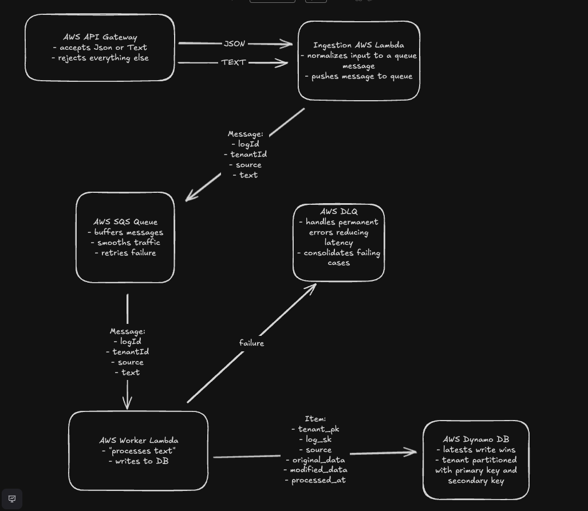

# Robust Data Sorter

Serverless log ingestion system with strict tenant isolation.

## Quick Start

```bash
# Install dependencies
npm install

# Build and deploy to AWS (crash simulation enabled by default)
./deploy.sh

# Run individual tests (see Test Suite section for recommended order)
./tests/test1-single.sh          # Start with smoke test
./tests/test6-idempotency.sh     # Then idempotency (before load tests)
```

## Crash Simulation Configuration

**IMPORTANT:** Crash simulation is **ENABLED BY DEFAULT** (configured in `terraform/variables.tf`).

This is required for Test 7 (Crash & DLQ) to pass. The deployment script `./deploy.sh` automatically applies this setting.

**To verify crash simulation is enabled:**
```bash
aws lambda get-function-configuration \
  --function-name log-worker-lambda \
  --region us-east-1 \
  --query 'Environment.Variables.CRASH_SIMULATION'
```

**To disable for production deployments:**
```bash
cd terraform
terraform apply -var='crash_simulation_enabled=false'
```

**To re-enable:**
```bash
cd terraform
terraform apply -var='crash_simulation_enabled=true'
```

## Test Suite

The system includes 7 comprehensive tests:

1. **Smoke Test** - Single request to verify basic functionality
2. **Normal Load** (1000 RPM) - Standard load test
3. **Normal Repeat** (1000 RPM) - Consistency verification
4. **Spike Test** (3000 RPM) - High load test
5. **Sustained Load** (500 RPM, 2 min) - Extended duration test
6. **Idempotency** - Verifies duplicate requests only create one record (tests both JSON and text/plain inputs)
7. **Crash & DLQ** - Tests worker crash simulation and dead-letter queue behavior (requires `crash_simulation_enabled=true`)

### Running Tests

**IMPORTANT: Run tests individually, not in sequence.** Load tests create large queue backlogs that interfere with subsequent tests.

**Recommended test order:**
```bash
# Start with clean, isolated tests first
./tests/test1-single.sh          # Smoke test (quick validation)
./tests/test6-idempotency.sh     # Idempotency test (run BEFORE load tests)
./tests/test-crash-dlq.sh        # Crash & DLQ test (~5 min)

# Then run load tests (creates queue backlog)
./tests/test2-normal.sh          # Normal load (1000 RPM)
./tests/test3-normal-repeat.sh   # Normal repeat
./tests/test4-spike.sh           # Spike test (3000 RPM)
./tests/test5-sustained.sh       # Sustained load (2 min)
```

**Why this order matters:**

The system is constrained by AWS account concurrency limits (10 total Lambda executions). With 7 workers allocated, processing throughput (~2.8 msg/sec) is much slower than load test input rate (~16.7 msg/sec at 1000 RPM). This intentionally creates queue backlog to demonstrate real-world behavior under constrained resources.

**Impact on tests:**
- Load tests (test2-5) build up ~840 message backlogs during 1-minute runs
- Queue takes several minutes to drain after test completes
- Idempotency test requires empty queue to verify exact record counts
- Running idempotency after load tests gives false results due to queue backlog

**Math:** 1000 RPM ÷ 60s = 16.7 msg/s incoming. 7 workers ÷ 2.5s processing time = 2.8 msg/s throughput. Backlog grows at ~14 msg/s during load tests.

**Between load tests:** Wait 30-60 seconds for queue to drain, or monitor with:
```bash
./tests/monitor-metrics.sh
```

**For a clean slate between test runs:**
```bash
./tests/clear-dynamodb.sh        # Clear all stored logs
# Wait for SQS queue to fully drain (check with monitor-metrics.sh)
```

---

1. Overview

The system exposes a single HTTP endpoint, POST /ingest, that accepts logs from two different sources:

* Structured JSON logs that contain tenant\_id, log\_id, and text in the body.

* Raw text logs that are sent as text/plain with the tenant specified in the X-Tenant-ID header.

Both forms must be normalized into a single internal flat text representation, pushed onto a message broker, processed asynchronously by a worker that simulates heavy CPU work by sleeping 0.05 seconds per character of text, and finally stored in a NoSQL database. The NoSQL design must strictly isolate tenants using either subcollections or partition keys. The whole system should be serverless, publicly accessible without auth, and able to scale to zero (no always-on VMs).

I implement this on AWS with TypeScript and Node.js, Amazon API Gateway, AWS Lambda, Amazon SQS as the broker, and Amazon DynamoDB as the NoSQL database. Terraform is used optionally to define the infrastructure as code.

---

2. End-to-end architecture

The logical flow of the system matches the problem’s diagram:

Client (JSON or TXT) → API Gateway → Ingest Lambda (Component A) → SQS (Message Broker) → Worker Lambda (Component B) → DynamoDB (NoSQL DB).

API Gateway exposes POST /ingest as a public HTTP endpoint. API Gateway invokes the Ingest Lambda. The Ingest Lambda validates and normalizes the incoming request, constructs a small message object containing tenant identity, a log identifier, the source type (json or text\_upload), and the log text in a uniform field, then sends this message to an SQS queue and returns HTTP 202 Accepted. The Worker Lambda is subscribed to the SQS queue and receives messages in batches. For each message, it simulates heavy processing by sleeping for 0.05 seconds times the number of characters in the text, then computes processed metadata and writes a record to DynamoDB. Only the worker writes to the NoSQL database; the ingestion path never touches storage directly.

Architecture Diagram : 
(https://link.excalidraw.com/readonly/hHybmTEjVqqpek7k5tki)
---

3. Component A – Unified ingestion endpoint (POST /ingest)

The ingestion component is a single Lambda function behind API Gateway, handling two input modes.

For the JSON mode, the client sends Content-Type: application/json and a body that contains tenant\_id, log\_id, and text. The handler validates that tenant\_id, log\_id, and text are present and well-formed, then it serializes into the internal txt format. It constructs an internal message with fields:

* tenantId: taken from tenant\_id.

* logId: taken from log\_id.

* source: the string "json".

* text: the text field from the JSON.

For the raw text mode, the client sends Content-Type: text/plain, sets X-Tenant-ID to the tenant identifier, and places the raw log content in the HTTP body as plain text. There is no log\_id in this case, so the ingestion function generates a log identifier on the server side (for example, using a UUID or ULID). For text uploads, the internal message becomes:

* tenantId: taken from the X-Tenant-ID header.

* logId: the generated identifier.

* source: the string "text\_upload".

* text: the raw body string.

In both cases, the result is a unified internal message shape with the same fields, so the downstream worker does not care whether the log came from JSON or a text upload.

After constructing this message, the Ingest Lambda serializes it as JSON and sends it as the body of a message to an SQS queue. It then immediately returns an HTTP 202 Accepted response to the client. The problem statement does not specify a required response body, so the minimal safe choice is a small JSON object such as { "status": "accepted" }. Returning tenant\_id and log\_id in the response would be convenient but is not required by the spec.

The key property is that this endpoint is non-blocking. It does not perform heavy processing and does not write to the NoSQL database. All heavy work and all storage operations are delegated to the worker through SQS. This design allows the endpoint to handle the “Flood” scenario of high request volume because each request only does lightweight validation, normalization, and a single SQS send before returning 202\.

---

4. Component B – Worker

The worker is implemented as a separate Lambda function that is triggered by messages in the SQS queue. AWS Lambda’s SQS event source mapping delivers batches of messages to the function.

For each SQS message, the handler parses the JSON body back into the internal message structure, recovering tenantId, logId, source, and text. The text field is the normalized flat text produced by the ingestion step.

To simulate CPU-bound heavy processing as required, the worker computes the length of the text and sleeps for 0.05 seconds per character. For example, if the text has 100 characters, the worker waits for 5 seconds before continuing. This fulfills the “sleep 0.05 seconds per character of text” requirement.

After the simulated heavy work, the worker builds the processed metadata that will be stored in the NoSQL database. The problem’s example document includes the fields source, original\_text, modified\_data, and processed\_at. The worker sets:

* source: copied from the internal message’s source field ("json" or "text\_upload").

* original\_text: the original text value from the message.

* modified\_data: a processed version of the original text. The exact transformation is not specified in the problem; one simple choice is to apply a deterministic text transformation such as masking phone-like patterns, or the worker can simply copy the original text unchanged. The important part is that this field exists and is derived from the original\_text.

* processed\_at: the timestamp when processing completed, stored as an ISO-8601 string.

The worker then writes this record to DynamoDB, using a key layout that enforces tenant isolation (described in the next section). After a successful write, the worker deletes the SQS message from the queue, acknowledging completion.

If the worker crashes, times out, or throws an error after receiving a message but before deleting it, SQS will eventually make the message visible again, and Lambda will reprocess it. Because a given (tenantId, logId) pair always maps to the same DynamoDB key, repeated processing due to retries simply overwrites the same record. This gives at-least-once processing semantics with idempotent storage. For messages that repeatedly fail, an SQS dead-letter queue can be configured, but that part is an implementation choice and not a strict requirement of the prompt.

The important constraints from the problem are honored: only the worker writes to the NoSQL DB, heavy processing is simulated with 0.05 seconds per character, and processing is decoupled via a managed broker.

---

5. Storage – DynamoDB schema and tenant isolation

The problem requires the use of a NoSQL database (Firestore or DynamoDB) and explicitly calls out a critical requirement: tenants must be strictly isolated using subcollections or partition keys. It presents a conceptual schema of tenants/{tenant\_id}/processed\_logs/{log\_id} and shows an example JSON document with source, original\_text, modified\_data, and processed\_at.

On AWS with DynamoDB, this is implemented as a single table with a partition key that encodes the tenant and a sort key that encodes the log identifier.

The table is named tenant\_processed\_logs.

The partition key attribute is called tenant\_pk (string). For each tenant, this key is set to a value such as "TENANT\#acme\_corp" or "TENANT\#beta\_inc". All items for the same tenant share the same partition key.

The sort key attribute is called log\_sk (string). For each log, it is set to a value such as "LOG\#123" when the log\_id comes from the JSON payload, or "LOG\#\<generated-id\>" when the log\_id is generated for a text upload.

A typical item in this table therefore looks like:

* tenant\_pk: "TENANT\#acme\_corp"

* log\_sk: "LOG\#123"

* source: "json" or "text\_upload"

* original\_text: the original log text

* modified\_data: the processed text

* processed\_at: the time processing completed

This layout mirrors the conceptual path: tenants/{tenant\_id}/processed\_logs/{log\_id}, the partition key corresponds to the tenant part of the path, and the sort key corresponds to the processed\_logs/{log\_id} portion.

Tenant isolation is achieved by always including the partition key in queries. To fetch logs for a particular tenant, the application queries DynamoDB with tenant\_pk \= "TENANT\#acme\_corp". This returns only that tenant’s logs. There is no “flat all\_logs table” where records for different tenants are mixed and distinguished only by a tenant\_id attribute. Instead, tenant identity is embedded into the key structure itself, which is exactly what the “strict isolation via partition keys” requirement is asking for.

---

6. Scale to zero and serverless properties

The problem states that the system must be deployed using serverless infrastructure and must be able to scale to zero, and explicitly forbids always-on VMs such as EC2. In this design:

* API Gateway is a managed service that does not require any servers to be provisioned.

* Both the ingestion component and the worker are AWS Lambda functions. Lambda allocates containers on demand when events arrive and tears them down when idle. When there are no incoming HTTP requests and no messages in the SQS queue, there are no Lambda containers running. In other words, there is no active compute when the system is idle.

* SQS and DynamoDB are managed services that charge primarily per request or per capacity unit, but they do not require dedicated VMs that run constantly.

Because all compute is implemented using Lambda and there are no EC2 instances or always-on VMs, the system satisfies the “scale to zero” and serverless constraints from the prompt.

---

7. Infrastructure as code (Terraform)

The problem says that using infrastructure-as-code tools such as Terraform is optional. If Terraform is used, it would define the following AWS resources:

* An SQS queue for ingest, and optionally a dead-letter queue.

* A DynamoDB table named tenant\_processed\_logs with tenant\_pk as the partition key and log\_sk as the sort key.

* A Lambda function for ingestion with permissions to send messages to the SQS queue.

* A Lambda function for the worker with permissions to receive and delete messages from the SQS queue and to write items to the DynamoDB table.

* An event source mapping that connects the SQS queue to the worker Lambda.

* An API Gateway HTTP API with a route POST /ingest integrated with the ingestion Lambda.

This keeps infrastructure reproducible and version-controlled, but it is an implementation detail rather than a hard requirement.

---

8. Failure Handling and Recovery

The system handles failures at both the ingestion and worker stages to ensure no data loss and graceful recovery from crashes.

**Ingestion Lambda Failures:**

1. **Crash before sending to SQS:**
   - API Gateway returns HTTP 500/502 to client
   - No message is enqueued
   - Client sees the error and can implement retry logic
   - No data loss if client retries failed requests

2. **Crash after sending to SQS but before returning 202:**
   - Message is already safely persisted in SQS
   - API Gateway still returns HTTP 500/502 to client
   - Client may retry, potentially creating a duplicate message in SQS
   - Worker processes both messages and overwrites the same DynamoDB record (same tenant_pk and log_sk)
   - Result: Message is processed successfully, possible duplicate work but idempotent storage prevents data corruption

**Worker Lambda Failures (Primary Resilience Mechanism):**

1. **Crash, timeout, or exception during processing:**
   - SQS message is NOT deleted (Lambda never acknowledged completion)
   - After the visibility timeout expires, SQS automatically makes the message visible again
   - Another Lambda instance picks up the message and retries processing

2. **Idempotent DynamoDB writes:**
   - Each (tenantId, logId) pair maps to a unique DynamoDB key (tenant_pk, log_sk)
   - Retried processing overwrites the same record with identical data
   - No duplicate records, no data corruption
   - Provides at-least-once processing semantics with eventual consistency

3. **Poison message handling:**
   - Messages that repeatedly fail after multiple retries can be routed to a dead-letter queue (DLQ)
   - Prevents problematic messages from blocking the queue indefinitely
   - DLQ messages can be inspected and reprocessed manually after fixing underlying issues

**Why worker resilience is more critical than ingestion:**

- Ingest Lambda is fast (50-100ms): validation + SQS send
- Worker Lambda is slow (2-5 seconds typical): 0.05s per character + DynamoDB write latency
- Worker is stateful: writes to persistent storage, requires proper retry and idempotency
- Ingest is stateless: simply forwards messages to SQS

The architecture naturally provides crash resilience through SQS's visibility timeout mechanism and DynamoDB's idempotent writes, ensuring the system can recover gracefully from failures without manual intervention.

